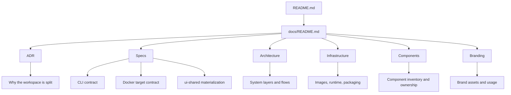

# Documentation

This directory is the technical documentation hub for the Conflux DevKit Workspace.

The public-facing project overview lives in the repository root `README.md`. The files in `docs/` are intended for maintainers, contributors, and advanced users who need implementation details.

The structure follows a light Diataxis-style split so readers can find the right kind of information quickly:

- explanation for architectural decisions and system boundaries
- reference for concrete contracts and implementation rules
- supporting brand and product materials for distribution work

## Map

## How to use this documentation

If you are new to the repository:

1. Read the root [README.md](../README.md) for the product overview and quick start.
2. Read [adr/0001-modular-product-split.md](adr/0001-modular-product-split.md) for the architectural rationale.
3. Use the specs in this directory as the source of truth for boundaries and packaging rules.

If you are changing the scaffold system:

1. Review [specs/scaffold-cli.md](specs/scaffold-cli.md).
2. Review [specs/ui-shared-materialization.md](specs/ui-shared-materialization.md).
3. Confirm the implementation still passes `pnpm run verify:templates`.

If you are changing runtime targets:

1. Review [specs/docker-decomposition.md](specs/docker-decomposition.md).
2. Inspect the relevant manifest in `targets/`.
3. Rebuild and validate the affected image targets.

## Sections

### Explanation

- [adr/0001-modular-product-split.md](adr/0001-modular-product-split.md)
- [architecture.md](architecture.md)
- [infrastructure.md](infrastructure.md)

Use this when you need to understand the current system structure and packaging model.

### Reference

- [components.md](components.md)
- [specs/scaffold-cli.md](specs/scaffold-cli.md)
- [specs/docker-decomposition.md](specs/docker-decomposition.md)
- [specs/ui-shared-materialization.md](specs/ui-shared-materialization.md)

Use these documents when you need exact behavior, ownership boundaries, or generation rules.

### Brand and release support

- [branding/README.md](branding/README.md)

Use this for logos, brand assets, presentation material, and submission assets.

## Authoring rules

When updating documentation in this repository:

- Keep the root README focused on orientation, quick start, and navigation.
- Keep specs factual and implementation-aligned.
- Avoid duplicating the same rule across multiple files unless the repetition helps a different audience complete a task.
- Prefer diagrams only when they clarify system boundaries or workflow.
- Update docs in the same change when commands, package names, or project structure changes.