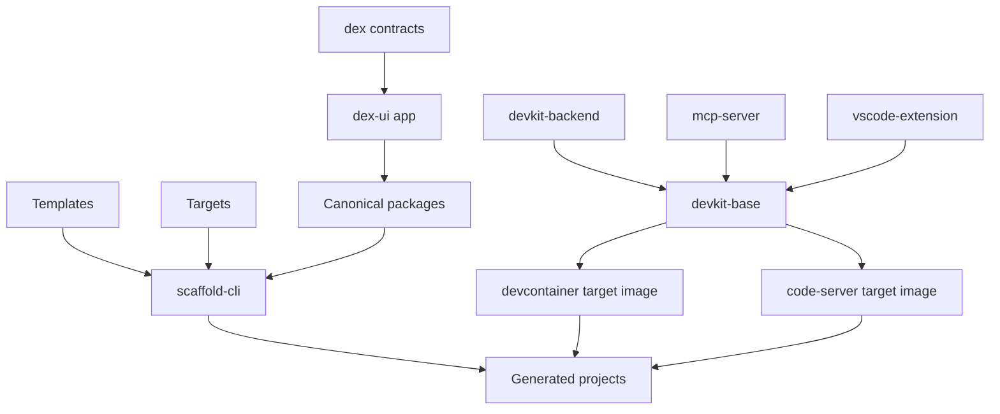
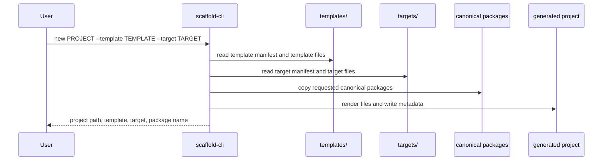
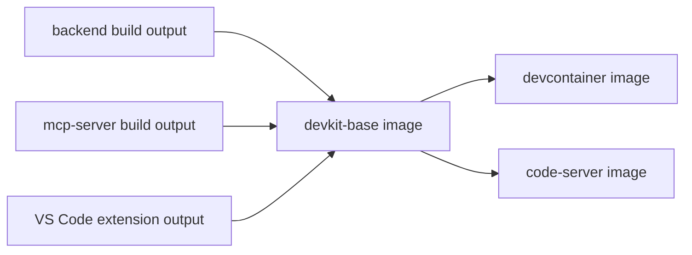

# Architecture

This document describes the high-level architecture of the Conflux DevKit Workspace.

## Goals

The workspace is designed around a few explicit constraints:

- generated projects must be self-contained after creation
- runtime infrastructure must stay separate from scaffold content
- editor targets must share as much common infrastructure as possible
- the scaffold CLI must stay publishable and usable outside the monorepo
- reusable packages must remain canonical in the monorepo and materialized only when needed

## System overview

## Layers

### 1. Authoring layer

This is the source-of-truth layer inside the monorepo.

It includes:

- templates in `templates/`
- runtime targets in `targets/`
- canonical reusable packages in `packages/`
- application surfaces such as `apps/dex-ui/`
- infrastructure packages such as the backend, MCP server, and VS Code extension

This layer is where maintainers make changes.

### 2. Packaging layer

This layer turns authored source into distributable assets.

The main packaging responsibilities are:

- assembling the npm-distributed scaffold CLI
- building target images from the shared base
- building compiled artifacts such as the backend distribution, MCP server distribution, extension output, and DEX contract artifacts

This layer exists to ensure the delivery surface is reproducible and detached from the monorepo layout where required.

### 3. Generated project layer

This is the consumer-facing output.

A generated project is composed from:

- one template
- one target
- zero or more materialized canonical packages
- generated metadata written by the scaffold process

The generated project should not require this repository after generation.

## Architectural split

### Scaffold generation

The published CLI package `@cfxdevkit/scaffold-cli` is responsible for generating projects.

It resolves:

- template manifests
- target manifests
- compatibility between template and target
- canonical package materialization
- render-time substitution such as project name and target feature flags

The scaffold package carries its own packaged `assets/` directory so `npx @cfxdevkit/scaffold-cli ...` works outside this repo.

### Runtime infrastructure

Runtime infrastructure is intentionally separate from scaffold generation.

It is built around:

- `@devkit/devkit-base` for shared runtime metadata and common configuration
- `@devkit/devkit-backend` for the backend binary and health surface
- `@devkit/mcp` for AI-agent tooling integration
- `devkit-workspace-ext` for shared editor commands and status integration

Targets consume this shared infrastructure rather than re-implementing it per scaffold.

### Reusable application packages

Reusable packages such as `@devkit/ui-shared` and `@devkit/conflux-wallet` are authored once in the monorepo.

Templates can request materialization of these packages during project generation.

This keeps:

- the authored source canonical
- the generated project independent
- the copy/materialization step explicit and verifiable

## Main flows

### Project generation flow

### Runtime image composition flow

## Generated project contract

Every generated project should include:

- the selected template content
- the selected target-owned files
- `.devkit/manifest.json`
- a generated target metadata module at the template-declared path
- any requested materialized packages

Some templates also generate additional metadata for frontend or deployment workflows.

## Template model

Current templates:

| Template | Intent | Default target | Materialized packages |
| --- | --- | --- | --- |
| `minimal-dapp` | Minimal starter | `devcontainer` | `ui-shared` |
| `project-example` | Full reference scaffold | `devcontainer` | `ui-shared`, `conflux-wallet` |
| `wallet-probe` | Wallet diagnostics app | `devcontainer` | none |

Templates own project shape, user-facing files, and generation metadata paths.

## Target model

Current targets:

| Target | Runtime type | Primary use | Feature flags |
| --- | --- | --- | --- |
| `devcontainer` | `editor` | local VS Code and Codespaces | `baseUrl=false`, `proxy=false`, `codeServer=false` |
| `code-server` | `browser-ide` | browser-based IDE | `baseUrl=true`, `proxy=true`, `codeServer=true` |

Targets own environment-specific files and runtime capability toggles.

## Application surfaces

The repository includes application surfaces that are not the same thing as scaffolds.

The most notable one is `apps/dex-ui/`, which is an example application surface built on top of shared packages and DEX contracts.

This distinction matters:

- templates generate projects
- apps are authored products or demos inside the monorepo

## Internal packages

Some workspace packages are internal support packages rather than direct public end-user surfaces.

Examples:

- `@devkit/template-core` exists as an internal helper concept, while the published scaffold flow runs from `packages/scaffold-cli/src/template-core.js`
- `@devkit/shared` provides typed HTTP client utilities for internal devkit tools

These packages remain part of the architecture because they define internal boundaries even when they are not exposed directly to end users.

## Related documents

- [README.md](../README.md)
- [architecture decision record](adr/0001-modular-product-split.md)
- [infrastructure.md](infrastructure.md)
- [components.md](components.md)
- [scaffold CLI specification](specs/scaffold-cli.md)