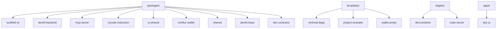

# Components reference

This document is the inventory and reference guide for the main components in the Conflux DevKit Workspace.

## Reading this reference

The repository is organized into several component types:

- packages
- templates
- targets
- apps
- contracts and generated artifacts

Each component below is listed with its role and how it relates to the rest of the system.

## Component map

## Packages

| Component | Path | Type | Purpose | Notes |
| --- | --- | --- | --- | --- |
| `@cfxdevkit/scaffold-cli` | `packages/scaffold-cli/` | Published npm package | Generates self-contained projects from templates and targets | Public scaffold distribution surface |
| `@devkit/devkit-backend` | `packages/devkit-backend/` | Internal runtime package | Shared backend binary and health surface for editor targets | Baked into infrastructure images |
| `@devkit/mcp` | `packages/mcp-server/` | Internal runtime package | MCP server for AI tooling and agent integration | Exposes `devkit-mcp` |
| `devkit-workspace-ext` | `packages/vscode-extension/` | Internal editor package | Shared VS Code command and status integration | Baked into editor images |
| `@devkit/ui-shared` | `packages/ui-shared/` | Canonical reusable package | Shared React UI components and hooks | Materialized into templates when requested |
| `@devkit/conflux-wallet` | `packages/conflux-wallet/` | Canonical reusable package | Wallet-related helpers and React-facing utilities | Materialized by `project-example` |
| `@devkit/shared` | `packages/shared/` | Internal utility package | Shared typed HTTP client and utilities | Used by internal devkit tools |
| `@devkit/devkit-base` | `packages/devkit-base/` | Internal infrastructure package | Shared runtime metadata and common configuration | Base for target images |
| `@cfxdevkit/dex-contracts` | `packages/contracts/` | Internal contract artifact package | Compiled Uniswap V2 contracts and mock tokens | Consumed by `apps/dex-ui` |
| `@devkit/template-core` | `packages/template-core/` | Internal/transitional package | Template discovery and materialization helpers | Concept remains important even though published scaffold flow is self-contained |

## Detailed package notes

### `@cfxdevkit/scaffold-cli`

Responsibilities:

- parse CLI commands
- list templates and targets
- create projects
- package scaffold assets for npm distribution

Key behaviors:

- supports `new` and `create`
- reads manifests from packaged `assets/` when distributed
- falls back to workspace assets in local development

### `@devkit/devkit-backend`

Responsibilities:

- provide backend runtime inside devkit images
- expose predictable health and service surfaces for editor targets
- keep runtime logic out of scaffold templates

### `@devkit/mcp`

Responsibilities:

- expose Conflux development tools to MCP-compatible agents
- ship as an executable used by generated workspaces and editor integrations

### `devkit-workspace-ext`

Responsibilities:

- provide commands for stack lifecycle, deployment, DEX actions, and Conflux operations
- surface shared devkit actions consistently in editor environments

### `@devkit/ui-shared`

Responsibilities:

- centralize shared React UI primitives and devkit-facing UI behavior
- act as the canonical source for copied scaffold UI code

### `@devkit/conflux-wallet`

Responsibilities:

- encapsulate reusable wallet logic for Conflux-oriented dapps
- support templates that need wallet primitives without duplicating authored code

### `@devkit/shared`

Responsibilities:

- provide common typed clients and utilities across internal tools

### `@devkit/devkit-base`

Responsibilities:

- define shared runtime configuration used by target images

### `@cfxdevkit/dex-contracts`

Responsibilities:

- compile and export contract artifacts for the local DEX stack and example applications

### `@devkit/template-core`

Responsibilities:

- preserve the internal model of template and target discovery helpers in the workspace

Current note:

- the published CLI path now carries a local self-contained `template-core.js`, but this package still documents the intended helper boundary in the repo

## Templates

| Template | Path | Role | Default target | Materialized packages |
| --- | --- | --- | --- | --- |
| `minimal-dapp` | `templates/minimal-dapp/` | Small starter project with minimal integration surface | `devcontainer` | `ui-shared` |
| `project-example` | `templates/project-example/` | Reference full-stack scaffold with dapp, contracts, and root scripts | `devcontainer` | `ui-shared`, `conflux-wallet` |
| `wallet-probe` | `templates/wallet-probe/` | Diagnostic wallet and provider testing app | `devcontainer` | none |

## Targets

| Target | Path | Runtime | Intended environment | Feature profile |
| --- | --- | --- | --- | --- |
| `devcontainer` | `targets/devcontainer/` | `editor` | local VS Code and Codespaces | no proxy, no base URL rewrite |
| `code-server` | `targets/code-server/` | `browser-ide` | browser IDE workflow | proxy-aware, code-server enabled |

## Applications

| App | Path | Purpose | Main dependencies |
| --- | --- | --- | --- |
| `dex-ui` | `apps/dex-ui/` | DEX swap UI and vault demo for the local Conflux dev node | `@cfxdevkit/dex-contracts`, `@devkit/ui-shared`, React, wagmi, viem |

## Supporting areas

| Area | Path | Role |
| --- | --- | --- |
| Contracts workspace | `contracts/` | Solidity source, Hardhat config, generated artifacts, and typechain output |
| Scripts | `scripts/` | Repository-level verification, artifact prep, and support tasks |
| Branding | `docs/branding/` | Brand system, presentation assets, screenshots, and submission support |
| Dapp generated files | `dapp/src/generated/` in templates or generated projects | Generated addresses, network metadata, or hooks |

## Ownership model summary

### Templates own

- project shape
- sample app logic
- project-level scripts
- generated metadata paths

### Targets own

- environment-specific configuration files
- browser-IDE versus editor-specific behavior
- proxy and base URL capabilities

### Canonical packages own

- reusable authored code that should not be hand-maintained independently across templates

### Infrastructure packages own

- backend runtime
- agent tooling
- editor integration
- shared image composition inputs

## Practical reference

If you are changing a component, use this quick guide:

- scaffold generation behavior: update `packages/scaffold-cli/`
- template content: update `templates/<template>/`
- runtime target behavior: update `targets/<target>/`
- reusable UI: update `packages/ui-shared/`
- reusable wallet logic: update `packages/conflux-wallet/`
- backend or MCP capabilities: update `packages/devkit-backend/` or `packages/mcp-server/`
- shared editor commands: update `packages/vscode-extension/`

## Related documents

- [architecture.md](architecture.md)
- [infrastructure.md](infrastructure.md)
- [scaffold CLI specification](specs/scaffold-cli.md)
- [ui-shared materialization contract](specs/ui-shared-materialization.md)