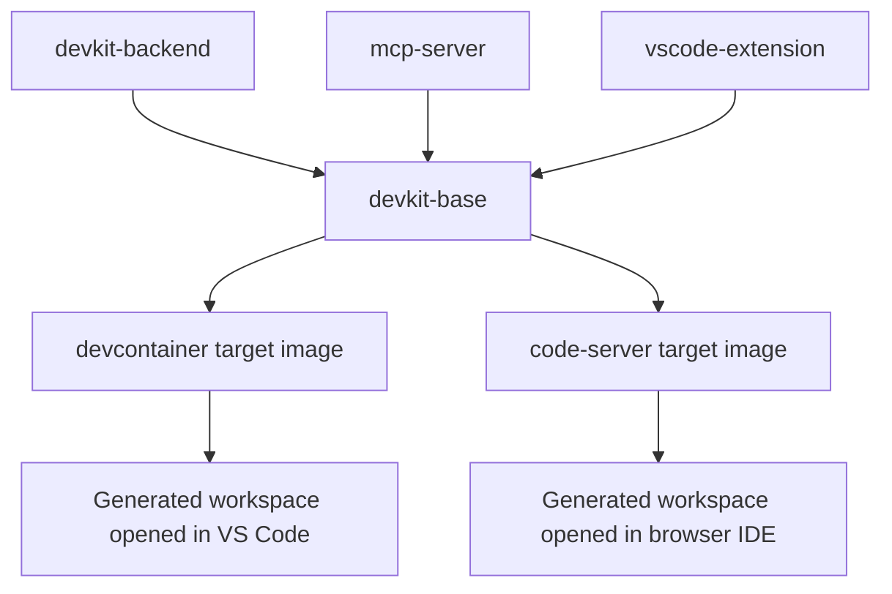

# Infrastructure

This document describes the runtime and packaging infrastructure used by the Conflux DevKit Workspace.

## Infrastructure scope

In this repository, infrastructure means:

- shared runtime packages
- Docker image composition
- editor integration surfaces
- build and validation commands
- image publishing and packaged artifact preparation

It does not mean template-owned project logic.

## Runtime building blocks

### Shared base

`@devkit/devkit-base` defines the shared runtime metadata and common configuration that downstream targets build on.

It is the common dependency for:

- development container images
- code-server images

### Backend runtime

`@devkit/devkit-backend` provides the backend binary embedded in devkit infrastructure images.

Its stated purpose is to:

- expose a deterministic health surface for editor targets
- provide a reusable `devkit-backend` binary across generated workspaces
- keep backend infrastructure out of scaffold templates

### MCP server

`@devkit/mcp` provides the `devkit-mcp` executable that exposes Conflux development tools for AI agents.

This package is part of the shared runtime rather than scaffold output.

### VS Code extension

`devkit-workspace-ext` is the editor integration layer baked into shared editor images.

Its role is to:

- provide a stable command surface in generated workspaces
- expose stack, network, deploy, DEX, and health actions in the editor
- avoid copying editor infrastructure into every template

## Target infrastructure

### Development container target

The `devcontainer` target is the default editor target for local VS Code and Codespaces.

Manifest summary:

- runtime: `editor`
- recommended: `true`
- base URL rewriting: `false`
- proxy support: `false`
- code-server support: `false`

This target is optimized for direct editor usage rather than browser proxy behavior.

### Code-server target

The `code-server` target is the browser IDE variant.

Manifest summary:

- runtime: `browser-ide`
- recommended: `false`
- base URL rewriting: `true`
- proxy support: `true`
- code-server support: `true`

This target owns the browser-IDE-specific behavior that should not leak into the default development container target.

## Infrastructure topology



## Image build workflow

The repository exposes a layered build flow through root scripts.

### Shared artifact preparation

```bash
pnpm run artifacts:prepare
```

This prepares shared devkit artifacts before image builds.

### Base image build

```bash
pnpm run image:build:base
```

This builds the shared base image and tags it locally and under GHCR naming.

### Target image builds

```bash
pnpm run image:build:devcontainer
pnpm run image:build:code-server
```

These build the target images on top of the shared base.

### Local image checks

```bash
pnpm run image:check:base
pnpm run image:check:devcontainer
pnpm run image:check:code-server
```

These verify that the expected image tags are present in the local Docker daemon.

## Published image names

The shared images are published to GHCR with these names:

- `ghcr.io/cfxdevkit/devkit-base`
- `ghcr.io/cfxdevkit/devkit-devcontainer`
- `ghcr.io/cfxdevkit/devkit-code-server`

Generated development container configurations are expected to reference the GHCR paths through build arguments.

## Scaffold packaging infrastructure

The scaffold CLI uses its own packaging step to stay independent of the monorepo at runtime.

### Package preparation

`packages/scaffold-cli/scripts/prepare-package.mjs` copies the required assets into `packages/scaffold-cli/assets/` before pack and publish.

That asset bundle includes:

- templates
- targets
- canonical package sources required for materialization

### Publish validation

```bash
pnpm run scaffold:pack
pnpm run scaffold:publish:dry-run
```

The intent is to guarantee that the npm package contains everything required for `npx @cfxdevkit/scaffold-cli ...` to work.

### Publish verification

After a real publish, verify the package is publicly readable and resolvable:

```bash
npm access get status @cfxdevkit/scaffold-cli
npm view @cfxdevkit/scaffold-cli version
npx @cfxdevkit/scaffold-cli new ./my-app --template minimal-dapp
```

If `npm publish` succeeds but `npm view` or `npx` still returns `404`, fix visibility first:

```bash
npm access set status=public @cfxdevkit/scaffold-cli
```

If registry metadata is stale on the local machine, retry with a version pin after clearing the npm cache:

```bash
npm cache clean --force
npx --yes @cfxdevkit/scaffold-cli@0.1.0 new ./my-app --template minimal-dapp
```

## Validation and smoke checks

### Template verification

```bash
pnpm run verify:templates
```

This validates generated project output and performs smoke checks on key generated files and scripts.

### Dev container verification

```bash
pnpm run verify:devcontainer:local
```

This validates the generated development container target with the installed Dev Containers CLI outside the VS Code UI.

## Infrastructure boundaries

The infrastructure model follows these rules:

- scaffold templates do not own backend or editor infrastructure
- the shared base must not bake template-specific app source into runtime images
- target-specific behavior belongs in `targets/`, not in templates
- code-server-specific proxy behavior must remain opt-in through the `code-server` target
- reusable packages are authored canonically and copied only at generation time when requested by templates

## Operational reference

### When changing the backend

Update the backend package and then validate the image pipeline that consumes it.

### When changing target-owned behavior

Update the relevant target manifest and target files, then regenerate and validate affected scaffolds.

### When changing packaged scaffold assets

Re-run scaffold pack and publish dry-run checks to confirm the packaged CLI still contains everything it needs.

## Related documents

- [architecture.md](architecture.md)
- [components.md](components.md)
- [Docker decomposition specification](specs/docker-decomposition.md)
- [scaffold CLI specification](specs/scaffold-cli.md)